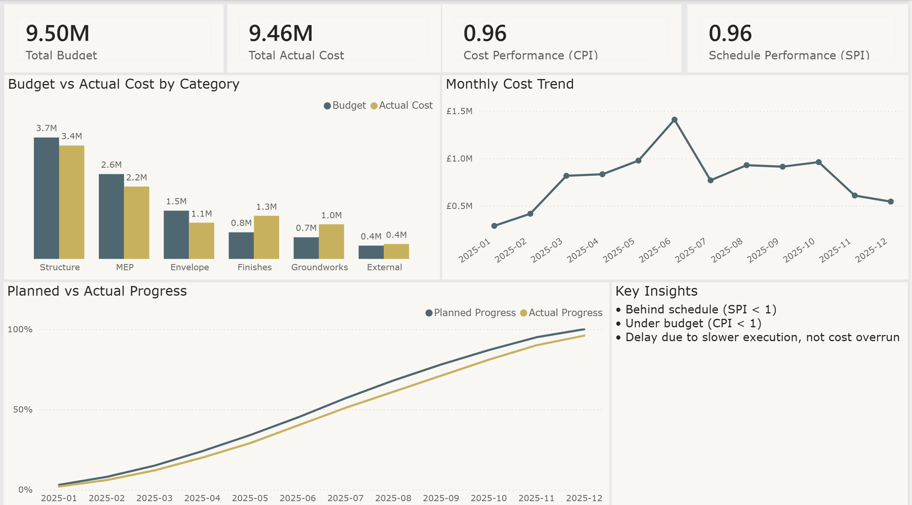
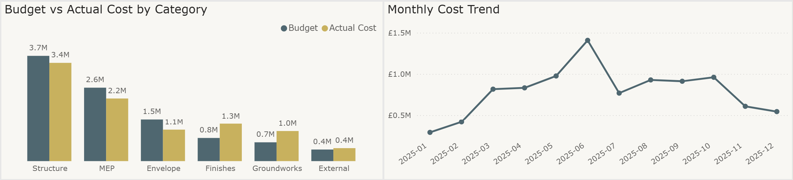
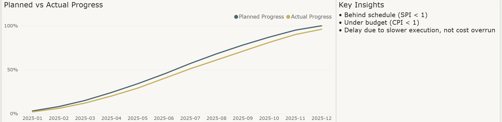

# Construction Cost & Performance Dashboard (Power BI)

## Overview
This project presents a construction project controls dashboard built using Excel and Power BI. It applies Earned Value Management (EVM) to track project cost and schedule performance, providing clear insights into budget utilisation and project progress.

---

## Dashboard Preview



### Additional Views





---

## Objective
To simulate a real-world construction project environment and demonstrate:
- Cost monitoring (Budget vs Actual)
- Schedule tracking (Planned vs Actual progress)
- Performance measurement using EVM metrics (CPI, SPI)

---

## Why This Project
This project demonstrates practical skills relevant to:
- Project Controls / PMO roles  
- Construction cost analysis  
- Data-driven decision making  

It focuses on solving a real business problem rather than just building visuals.

---

## Project Workflow

1. Created structured dataset in Excel:
   - Bill of Quantities (BoQ)
   - Monthly costs
   - Progress tracking

2. Built EVM model in Excel:
   - Planned Value (PV)
   - Earned Value (EV)
   - Actual Cost (AC)
   - Cost Variance (CV)
   - Schedule Variance (SV)
   - Cost Performance Index (CPI)
   - Schedule Performance Index (SPI)

3. Loaded data into Power BI:
   - Cleaned data using Power Query
   - Created a category dimension table
   - Established relationships between tables

4. Developed dashboard:
   - KPI cards for summary metrics
   - Cost analysis by category
   - Monthly cost trend
   - S-curve (planned vs actual progress)
   - Insight summary

---

## Dataset Description

- **BoQ (Bill of Quantities):**
  - Categories: Structure, MEP, Envelope, Finishes, Groundworks, External
  - Budget allocated per category

- **Monthly Costs:**
  - Actual cost recorded per category and month

- **Progress Data:**
  - Planned and actual progress percentages over time

---

## Key Concepts Implemented

- Earned Value Management (EVM)
- Cost and schedule performance analysis
- Data modelling (dimension and fact tables)
- Power BI relationships and aggregation
- Dashboard design for business users

---

## Key Findings

- Total Budget: £9.50M  
- Total Actual Cost: £9.46M  
- Cost Performance Index (CPI): 0.96  
- Schedule Performance Index (SPI): 0.96  

- Project is slightly behind schedule and slightly over budget at completion  
- Cost distribution varies across major categories such as Structure and MEP  
- Progress tracking highlights consistent lag between planned and actual execution  

---

## Tools Used

- Excel (data preparation and EVM calculations)
- Power BI (data modelling and visualisation)

---

## Project Structure

```
construction-cost-dashboard/
├── data/
│   ├── construction_cost_dashboard.xlsx
│   └── construction_dashboard.pbix
├── docs/
│   └── progress_log.md
├── screenshots/
│   ├── dashboard_overview.png
│   ├── cost_analysis.png
│   └── progress_analysis.png
├── README.md
```

---

## Status
Completed. Dashboard built, validated, and prepared for portfolio use.